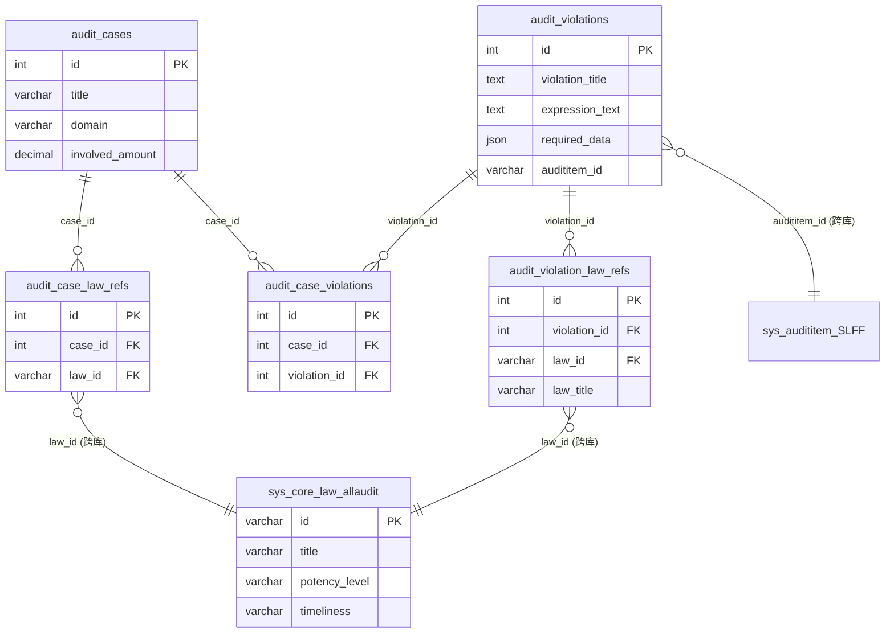

# 知识工坊三库数据表设计文档

> **文档定位**：知识工坊（Knowledge Workshop）三大库——**违规库 / 法规库 / 案例库**——的数据表设计。
> **性质**：现状文档化 + 补全 `schema.sql` 缺口。所有表结构均来自 192.168.3.164 实测 `SHOW CREATE TABLE`，非臆造。
> **生成日期**：2026-08-07
> **实测数据库**：`tt`（本项目自建）、`audit_law`（外部法规源，只读）

---

## 一、概述

知识工坊是审计工坊三大工坊之一，对应前端 [knowledge.js](../frontend/js/knowledge.js) 的三个 Tab：

| Tab | 库 | 角色 |
|---|---|---|
| 违规 | 违规库 | 审计"查什么"——违规模型 + 表达式 + 所需数据 |
| 法规 | 法规库 | 审计"凭什么"——法律依据、条款、关系链 |
| 案例 | 案例库 | 审计"怎么查"——历史案例、审计方法、发现 |

三库之间通过**三向关联**（违规↔法规、案例↔违规、案例↔法规）形成知识网络，这是知识工坊"三向关联"交互（点击违规卡片可跳关联法规/案例，点击案例可看违规模型/法规依据）的数据底座。

---

## 二、数据分布总览

三库的数据**不全部落在本项目**，这是最重要的架构事实：

```
┌─────────────────────────── tt 库（本项目自建，可读写）───────────────────────────┐
│                                                                              │
│   违规库                     案例库                  关联表（三向关联桥）       │
│  audit_violations          audit_cases            audit_violation_law_refs   │
│     (2,226 行)              (2,632 行)            audit_case_violations      │
│         ↑                        ↑                audit_case_law_refs        │
│         │                        │                    ↑         ↑            │
│         └────────────────────────┴────────────────────┘         │            │
│                      law_id / violation_id 关联                   │            │
└──────────────────────────────────────────────────────────────────┼────────────┘
                                                                   │ law_id
                                                    ┌──────────────▼─────────────────┐
                                                    │ audit_law 库（外部，只读跨库 JOIN）│
                                                    │                                │
                                                    │  sys_core_law_allaudit (8,607) │ ← 法规主表（审计子集）
                                                    │  sys_core_law      (353,069)   │ ← 法规全量（回退用）
                                                    │  tools_regulation_relation     │ ← 法规关系链
                                                    │  tools_clause_relation         │ ← 条款分析
                                                    │  sys_audititem_SLFF            │ ← 审计事项树
                                                    └────────────────────────────────┘
```

**设计决策（已确认）：**

| 决策 | 选择 | 理由 |
|---|---|---|
| 法规库归属 | **跨库只读 `audit_law`** | 法规数据量大、由外部维护，本项目只存 `law_id` 关联，不复制主数据 |
| 法规数据源 | **`audit_law`（现状）** | 不引入 `auditkm_factory` 切换的不确定性；切换方案见 [LAW_SOURCE_SWITCH_PLAN.md](LAW_SOURCE_SWITCH_PLAN.md) |
| 案例库归属 | **`tt` 库自建** | 案例是本项目核心资产，需可读写（CRUD + 种子导入） |
| 文档形态 | **三库合一** | 三库靠关联表强耦合，合一描述关联关系最清晰 |

---

## 三、违规库

### 3.1 `tt.audit_violations` — 违规行为主表

违规库的核心。每条记录是一个"违规模型"：描述某种违规行为、如何用表达式检测、需要哪些数据、关联哪些法规。

**实测 2,226 行。**

| 字段 | 类型 | 说明 |
|---|---|---|
| `id` | int PK | 主键 |
| `violation_code` | varchar(50) | 违规行为编码 |
| `violation_title` | text | 违规行为名称（前端列表标题） |
| `audititem_id` | varchar(32) | 关联审计事项分类（→ `audit_law.sys_audititem_SLFF`） |
| `category_path` | varchar(500) | 分类路径（前端按此分 Tab：`领域/子类`） |
| `severity` | varchar(20) | 严重度 high/medium/low |
| `expression_text` | text | **违规表达式伪 SQL**（数据比对的"比对逻辑"，由 expression-mcp 执行） |
| `audit_procedure` | mediumtext | 审计方法步骤（Markdown） |
| `required_data` | json | **审计所需数据**（`{items:[{name,material_type,fields}]}`，前端"📊审计所需数据"卡片） |
| `description` | text | 违规描述（前端从中正则提取 `《法规名》` 作为关联法规提示） |
| `source_file` | varchar(255) | 来源文件 |
| `author` | varchar(200) | 来源单位 |
| `import_batch` | varchar(100) | 导入批次 |
| `is_reviewed` / `review_status` | tinyint / varchar(20) | 审核状态 |
| `create_time` / `update_time` | datetime | 时间戳 |
| `deleted` | bit(1) | 软删除 |

**索引**：`idx_code`、`idx_audititem`、`idx_review(is_reviewed, review_status)`

**关键设计点：**
- `expression_text` + `required_data` 是违规库能驱动智能分析的关键——前者是"怎么判"，后者是"用什么数据判"。
- `audititem_id` 把违规挂到审计事项树（`audit_law.sys_audititem_SLFF`），形成"审计事项 → 违规"层级。约 86% 的违规挂树成功。
- 软删除 `deleted`，所有查询需带 `deleted = 0`。

> ⚠️ **schema.sql 缺口**：现有 `schema.sql` 的 `audit_violations` 漏了 `audit_procedure`、`required_data` 两个字段。这两个字段是 Phase 后期加的（驱动智能分析必需），本文档第三章附录 DDL 已补全。

---

## 四、案例库

### 4.1 `tt.audit_cases` — 案例主表

历史审计案例，每个案例含案情、方法、发现、影响，并关联到违规模型和法规。

**实测 2,632 行。**

| 字段 | 类型 | 说明 |
|---|---|---|
| `id` | int PK | 主键 |
| `title` | varchar(500) NOT NULL | 案例标题 |
| `domain` | varchar(100) | 领域（前端按此分 Tab + 下拉框筛选） |
| `case_summary` | text | 案情摘要 |
| `audit_method` | text | 审计方法（核查手段） |
| `involved_amount` | decimal(20,2) | 涉案金额（前端展示 `¥xxx`） |
| `audit_finding` | text | 审计发现（违规表现） |
| `audit_impact` | text | 风险影响 |
| `source` | varchar(500) | 来源 |
| `created_at` | datetime | 创建时间（列表 `ORDER BY created_at DESC`） |

**索引**：`idx_domain`、`idx_created_at`

**关键设计点：**
- 案例本身不存违规/法规的完整信息，只通过关联表（§5）挂接 ID，展示时再 JOIN 聚合（`GROUP_CONCAT` 拼名）。
- 数据来源：Excel 导入（[import_excel.py](../backend/data/import_excel.py)）+ 种子生成（[seed_cases.py](../backend/data/seed_cases.py)）+ API 创建（`POST /api/audit/cases`）。

---

## 五、三向关联表（核心）

知识工坊的"三向关联"完全靠这三张桥表实现，**全部在 `tt` 库**。

### 5.1 `tt.audit_violation_law_refs` — 违规 ↔ 法规

**实测 2,627 行。** 从 YAML 模板的 regulation JSON 字段拆解而来。

| 字段 | 类型 | 说明 |
|---|---|---|
| `id` | int PK | 主键 |
| `violation_id` | int NOT NULL | → `audit_violations.id`（外键 CASCADE 删除） |
| `law_id` | varchar(32) NOT NULL | → **外部** `audit_law.sys_core_law_allaudit.id` |
| `law_title` | varchar(500) | 法规名称（**冗余**，方便不跨库也能显示名称） |
| `clause_ref` | varchar(500) | 条款引用 |

**约束**：`uk_violation_law(violation_id, law_id)` 唯一；`violation_id` 外键 `ON DELETE CASCADE`。

### 5.2 `tt.audit_case_violations` — 案例 ↔ 违规

**实测 2,632 行。**

| 字段 | 类型 | 说明 |
|---|---|---|
| `id` | int PK | 主键 |
| `case_id` | int NOT NULL | → `audit_cases.id` |
| `violation_id` | int NOT NULL | → `audit_violations.id` |

**约束**：`uk_cv(case_id, violation_id)` 唯一。

### 5.3 `tt.audit_case_law_refs` — 案例 ↔ 法规

**实测 3,143 行。** 案例关联的法规（多数继承自其关联违规的法规）。

| 字段 | 类型 | 说明 |
|---|---|---|
| `id` | int PK | 主键 |
| `case_id` | int NOT NULL | → `audit_cases.id` |
| `law_id` | varchar(32) NOT NULL | → **外部** `audit_law.sys_core_law_allaudit.id` |

**索引**：`idx_law`、`idx_case`

---

## 六、法规库（外部只读）

法规库**本项目不建表**，全部跨库只读 `audit_law`。`tt` 库侧只通过两张 `*_law_refs` 关联表持有 `law_id`。下面是知识工坊各功能实际读取的外部表：

### 6.1 法规主数据读取映射

| 前端功能 | 后端函数 | 读取的 audit_law 表 | 用途 |
|---|---|---|---|
| 法规列表 / 搜索 | `search_laws` | `sys_core_law_allaudit` (8,607) | 关键词全文 + potency_level/timeliness 筛选 |
| 法规详情 | `get_law_detail` | `sys_core_law_allaudit` → 回退 `sys_core_law` (353,069) | 审计子集优先，全量库兜底 |
| 效力级别下拉框 | `get_potency_levels` | `sys_core_law_allaudit` | `DISTINCT potency_level` |
| 时效性 | `get_timeliness` | `sys_core_law_allaudit` | `DISTINCT timeliness` |
| 法规关系链 | `get_regulation_graph` | `tools_regulation_relation` | 上位法/下位法/相关法/历史版本（双向查 law_id↔related_law_id） |
| 条款分析 | `get_law_clauses` | `tools_clause_relation` | clause_type/clause_number/clause_summary/audit_scenario |
| 审计事项树 | `get_audititem_*` | `sys_audititem_SLFF` | 违规 `audititem_id` 挂载的审计事项树 |

> **关键**：所有法规查询都用 `sys_core_law_allaudit`（审计专用子集，8,607 行），而非全量 `sys_core_law`（35 万行）。前者是后者的审计相关子集，有独立 FAISS 索引。仅当子集查不到时回退全量库。

### 6.2 外部表关键字段速览

**`sys_core_law_allaudit`（法规主表，前端列表/详情用）：**
`id`(varchar32) · `title` · `content` · `issue_unit`(发布机关) · `issue_no`(文号) · `issue_date` · `implement_date` · `timeliness`(时效性) · `potency_level`(效力级别) · `status`(0未审/1通过/2不通过) · `region_type`(0国家/1地方)

**`tools_regulation_relation`（关系链）：**
`law_id` · `related_law_id` · `relation_type`(上位法/下位法/相关法/…) · `confidence` · `status`

**`tools_clause_relation`（条款）：**
`law_id` · `clause_type` · `clause_number` · `clause_summary` · `audit_scenario` · `audit_tags`(JSON，定性/处罚依据)

---

## 七、ER 关系图



**三向关联走法（举例：点违规卡片查关联案例）：**
`audit_violations.id` → `audit_case_violations.violation_id` → `audit_case_violations.case_id` → `audit_cases`。

**案例详情三向聚合（[phase6_routes.py](../backend/routes/phase6_routes.py) `case_detail`）：**
- 关联违规：`audit_case_violations` JOIN `audit_violations`
- 关联法规：`audit_case_law_refs` JOIN `audit_law.sys_core_law_allaudit`（跨库 + COLLATE）
- 同类案例：`audit_cases WHERE domain = ?`

---

## 八、查询模式与索引

| 表 | 典型查询 | 命中索引 |
|---|---|---|
| `audit_violations` | 按 category_path 分类分页 + 关键词 | （⚠️ category_path 无索引，靠 LIMIT） |
| `audit_cases` | 列表 `ORDER BY created_at DESC LIMIT` | `idx_created_at` |
| `audit_cases` | 按 domain 筛选 | `idx_domain` |
| `audit_case_law_refs` | 按 case_id 查关联法规 | `idx_case` |
| `audit_violation_law_refs` | 按 violation_id 查关联法规 | `uk_violation_law` 覆盖 |

> ⚠️ `audit_violations.category_path` 高频用于分类筛选但无索引，数据量大时可考虑加前缀索引（参考 [migrate.py](../backend/data/migrate.py) 的 `migrate_case_indexes` 模式）。

---

## 九、运维与坑点

### 9.1 跨库字符集不一致（重要）

`tt` 库关联表的 `law_id` 是 `utf8mb4_0900_ai_ci`，但 `audit_cases` 等表主体是 `utf8mb4_unicode_ci`。跨库 JOIN `audit_law`（也是 `0900_ai_ci`）时，若 SQL 里混用会出现字符集冲突。现状解法是在 JOIN 条件显式 `COLLATE`：

```sql
-- phase6_routes.py case_detail 的关联法规查询
FROM tt.audit_case_law_refs cl
JOIN audit_law.sys_core_law_allaudit l
  ON cl.law_id COLLATE utf8mb4_0900_ai_ci = l.id
```

> 案例列表查询（`phase6_cases_list`）已通过让 `law_id` 列本身用 `0900_ai_ci` 排序规则，免去了 COLLATE。新增跨库 JOIN 时务必验证字符集。

### 9.2 法规源切换的影响

若未来按 [LAW_SOURCE_SWITCH_PLAN.md](LAW_SOURCE_SWITCH_PLAN.md) 切到 `auditkm_factory`：
- `audit_violation_law_refs`（2,627 条）和 `audit_case_law_refs`（3,143 条）的 `law_id` **需全部重新匹配**（两库 law_id 体系仅约 15% 重叠）。
- `law_title` 冗余字段可缓解显示问题，但 JOIN 关系会断。
- 这是法规库选择"只读 + law_id 关联"架构的固有代价，切换前必须有重匹配脚本。

### 9.3 软删除约定

- `audit_violations.deleted`（bit）：违规库软删，查询需 `deleted = 0`。
- `audit_cases`：**无软删除字段**，案例删除为物理删除（注意关联表清理）。
- 外部 `audit_law` 表各自有自己的 `deleted`/`status` 约定，跨库查询时需带对应过滤（如 `status = 1` 审核通过）。

### 9.4 冗余字段策略

`audit_violation_law_refs.law_title` 是有意冗余——即使外部法规库不可用或 law_id 失效，前端仍能显示法规名称。这是"跨库只读"架构下的容错设计。`audit_case_law_refs` 未冗余 law_title（靠 JOIN 取），切换数据源时风险更高。

---

## 十、与 schema.sql 的缺口对照

`backend/data/schema.sql` 当前只记录了知识工坊 **1 张表**（`audit_violations`），实际运行的有 **5 张表**。缺口如下：

| 表 | schema.sql 现状 | 处理 |
|---|---|---|
| `audit_violations` | ⚠️ 有，但漏 `audit_procedure`、`required_data` 两字段 | 补字段 |
| `audit_violation_law_refs` | ❌ 完全缺失 | **新增 DDL** |
| `audit_cases` | ❌ 完全缺失 | **新增 DDL** |
| `audit_case_violations` | ❌ 完全缺失 | **新增 DDL** |
| `audit_case_law_refs` | ❌ 完全缺失 | **新增 DDL** |

完整 DDL 见补全后的 `schema.sql`（本次同步更新）。

---

## 附录：实测行数快照（2026-08-07）

| 表 | 行数 |
|---|---|
| `tt.audit_violations` | 2,226 |
| `tt.audit_violation_law_refs` | 2,627 |
| `tt.audit_cases` | 2,632 |
| `tt.audit_case_violations` | 2,632 |
| `tt.audit_case_law_refs` | 3,143 |
| `audit_law.sys_core_law_allaudit` | 8,607 |
